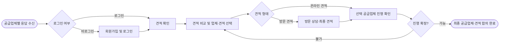

> 이 문서는 2026-07-30 기준 Outline 내보내기를 정규화한 공개용 스냅샷입니다. 내부 원본 링크와 담당자 표기는 제거했습니다. 현재 구현과 충돌하면 최신 승인 문서와 현재 코드가 우선합니다.

- **상태**: 내부 검토
- **사용자**: 고객
- **목표**: 공급업체별 견적을 확인·비교해 최종 공급업체와 견적을 합의한다.
- **시작 조건**: 공급업체별 유효 응답을 하나 이상 수신한다.

## 시나리오 흐름

## 핵심 기준

- 회원만 견적을 확인할 수 있으며 비로그인 고객은 회원가입 및 로그인 후 확인한다.
- 고객은 유효한 견적을 비교해 공급업체와 견적을 선택한다.
- 방문 견적은 상담·현장 확인 후 제출된 최종 견적을 기준으로 선택한다.
- 선택 공급업체가 해당 견적 조건으로 진행 가능함을 확인하면 1차 E2E 흐름이 완료된다.
- 고객–공급업체 계약과 계약서 처리는 후속 업무이며 1차 범위에 포함하지 않는다.

## 예외·확인 필요

- 선택 공급업체가 진행 불가하면 견적 비교·업체 선택 단계로 돌아간다.

## 관련 자료

- **범위 결정**: 계약 도메인 제외

## 변경 이력

| 날짜       | 변경                                                                                        | 근거           |
| ---------- | ------------------------------------------------------------------------------------------- | -------------- |
| 2026-07-28 | 계약(CT) 도메인을 1차 범위에서 제외하고 E2E 완료 지점을 최종 공급업체·견적 합의 완료로 변경 | 범위 결정 기록 |
