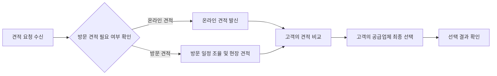

> 이 문서는 2026-07-30 기준 Outline 내보내기를 정규화한 공개용 스냅샷입니다. 내부 원본 링크와 담당자 표기는 제거했습니다. 현재 구현과 충돌하면 최신 승인 문서와 현재 코드가 우선합니다.

- 상태: 내부 검토
- 사용자: 공급업체
- 목표: 견적 요청에 응답하고 고객의 공급업체 최종 선택 결과를 확인한다.

### 시나리오 흐름

### 핵심 기준

- 견적 요청에는 24시간 이내 응답한다.
- 1차 범위는 고객의 공급업체 최종 선택에서 종료한다.
- 계약·계약서 업로드·수신·확인·승인 및 계약 확정은 1차 범위에서 제외한다.
