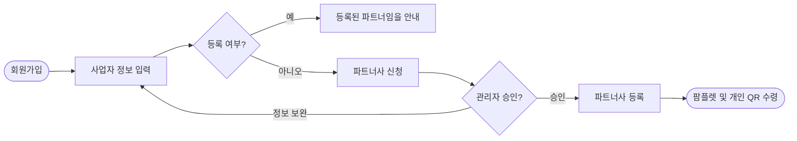

> 이 문서는 2026-07-30 기준 Outline 내보내기를 정규화한 공개용 스냅샷입니다. 내부 원본 링크와 담당자 표기는 제거했습니다. 현재 구현과 충돌하면 최신 승인 문서와 현재 코드가 우선합니다.

- **상태**: 내부 검토
- **사용자**: 영업 파트너
- **목표**: 파트너사 신청과 관리자 승인을 완료하고 팜플렛 및 개인 QR을 수령한다.
- **시작 조건**: 회원가입을 시작한다.

## 시나리오 흐름

## 핵심 기준

- 사업자 정보 입력 후 기존 파트너 등록 여부를 확인한다.
- 미등록 상태이면 파트너사 신청을 진행한다.
- 관리자 승인 후 파트너사로 등록되고 팜플렛 및 개인 QR을 수령한다.
- 등록 정보에는 사업자명, 사업자등록번호, 대표자, 대표 전화번호, 사업장 주소, 정산계좌가 포함되며 자격정보는 선택 항목이다.

## 예외·확인 필요

- **예외**: 이미 등록된 사업자 정보이면 등록된 파트너임을 안내한다.
- **예외**: 정보 보완이 필요하면 사업자 정보 입력 단계로 돌아간다.
