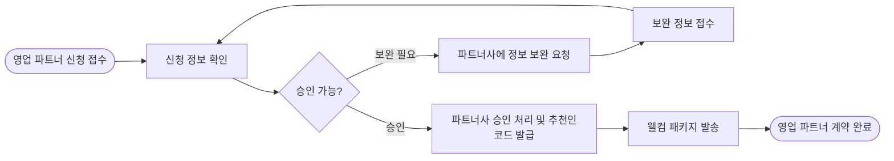

> 이 문서는 2026-07-30 기준 Outline 내보내기를 정규화한 공개용 스냅샷입니다. 내부 원본 링크와 담당자 표기는 제거했습니다. 현재 구현과 충돌하면 최신 승인 문서와 현재 코드가 우선합니다.

- **상태: 내부 검토**내부 검토
- **사용자**: 원큐 운영사 관리자
- **목표**: 영업 파트너 신청을 검토하고 승인 및 추천코드 발급을 완료한다.
- **시작 조건**: 영업 파트너 신청이 접수된다.

## 시나리오 흐름

## 핵심 기준

- 운영사 관리자가 영업 파트너 신청 정보를 확인한다.
- 보완이 필요한 경우 보완 정보를 다시 접수해 검토한다.
- 승인 시 파트너사 승인 처리와 추천코드 발급을 함께 진행한다.
- 승인 완료 후 웰컴 패키지를 발송한다.

## 예외·확인 필요

- **예외**: 신청 정보가 부족하면 파트너사에 보완을 요청한다.
