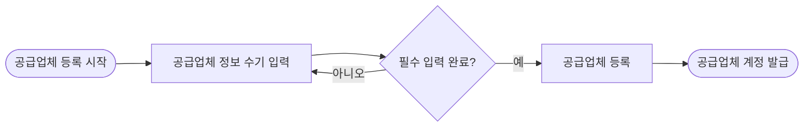

> 이 문서는 2026-07-30 기준 Outline 내보내기를 정규화한 공개용 스냅샷입니다. 내부 원본 링크와 담당자 표기는 제거했습니다. 현재 구현과 충돌하면 최신 승인 문서와 현재 코드가 우선합니다.

- **상태**: 내부 검토
- **사용자**: 원큐 운영사 관리자
- **목표**: 공급업체 정보를 수기로 등록하고 공급업체 계정을 발급한다.
- **시작 조건**: 관리자가 공급업체 등록을 시작한다.

## 시나리오 흐름

## 핵심 기준

- 공급업체 정보는 운영사 관리자가 수기로 입력한다.
- 필수 정보 입력이 완료된 경우에만 공급업체를 등록한다.
- 등록 완료 후 공급업체 계정을 발급한다.

## 예외·확인 필요

- **예외**: 필수 정보가 누락되면 정보 입력 단계로 돌아간다.
